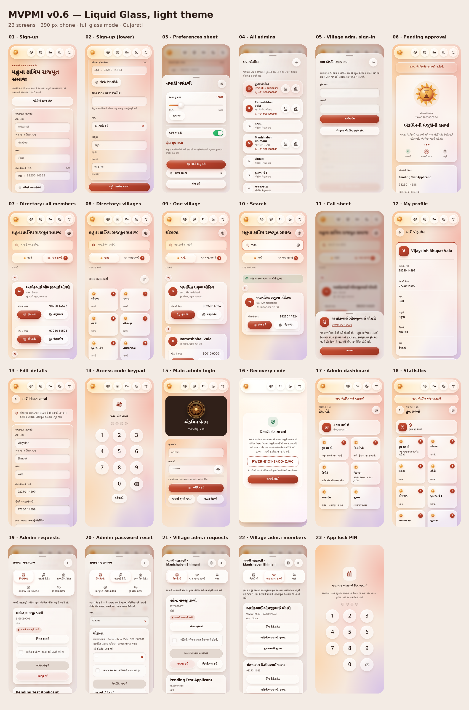
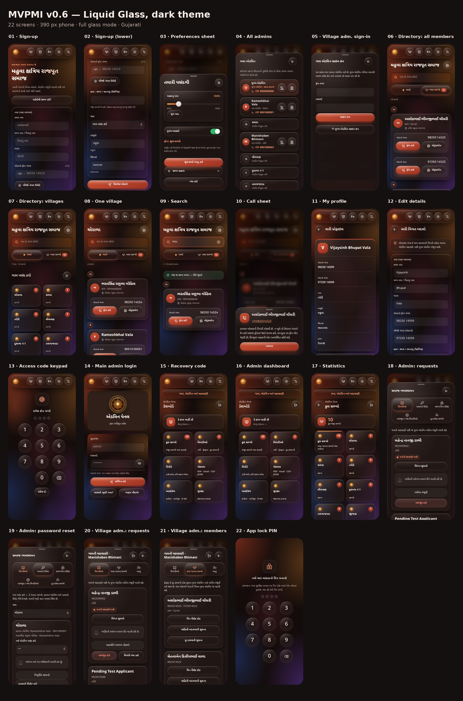
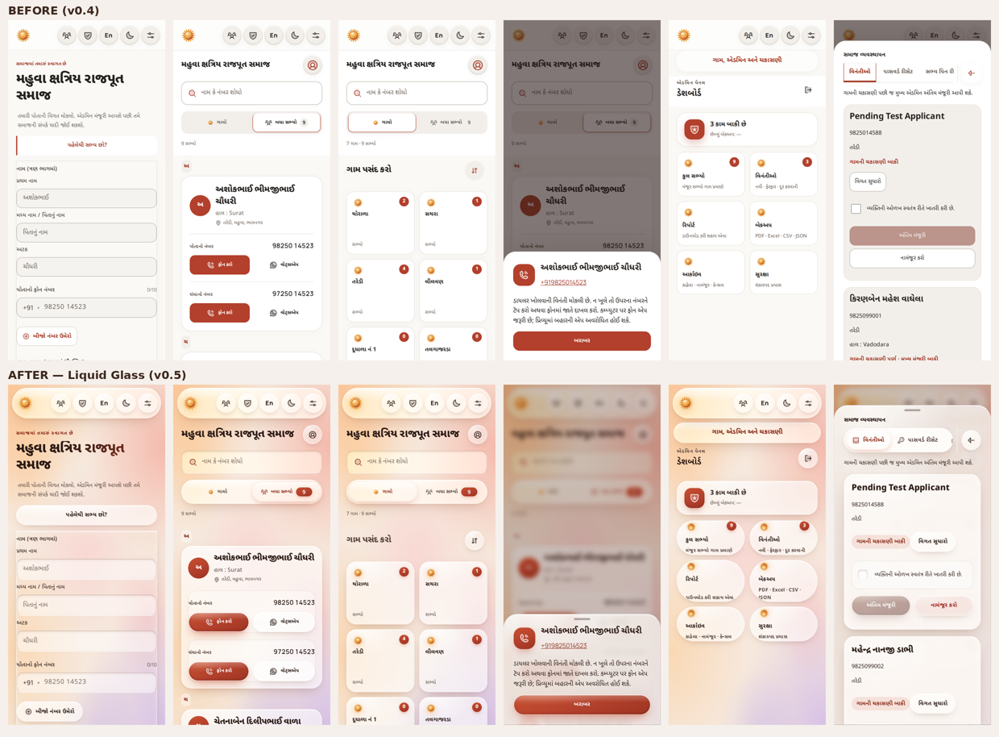
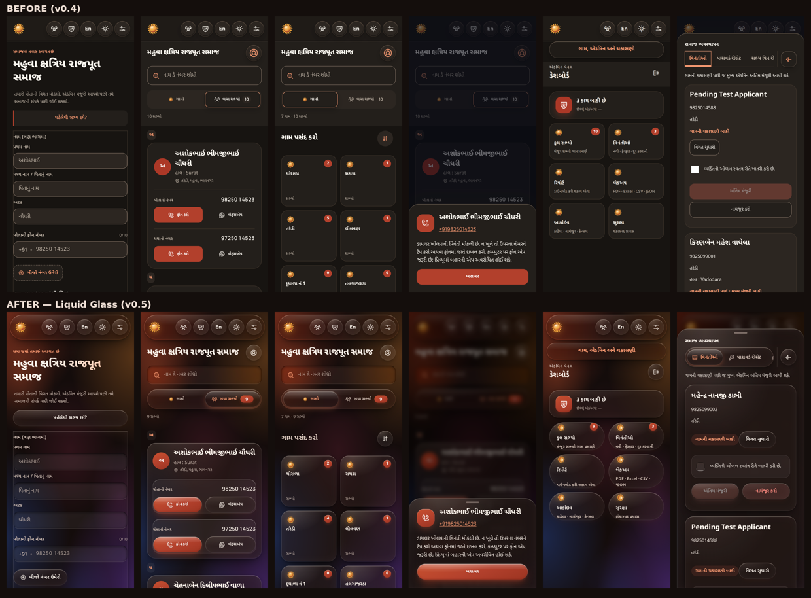

# Liquid Glass UI — v0.6 (iOS style, light & dark)

## v0.6 precision pass

Checkpoint before this pass: git tag **`Pre-LiquidGlass-v3`** (end of v0.5.0),
branch `design/liquid-glass-v3`. Only presentation changed (CSS, plus the tab
lens now also follows the vertical position); every handler, text and API
call is identical.

| Problem found | Fix |
|---|---|
| Admin section tabs were cut off at the edge of a scrolling strip ("મારા ગામ…") and squeezed next to Back / Sign out | Back and Sign out moved to the title row; section tabs became an iOS tab-bar grid (icon above label, max three per row, a last row of two shares the width). The glass lens slides between rows too |
| Long names in the sheet title were cut with "…" | Title wraps onto a second line instead |
| "ચકાસીને આગળ મોકલો" broke onto two lines inside a half-width capsule | Main action takes the full width; the other actions share the next row equally; three quiet actions become a neat full-width list |
| Status chip glued to the "Correct details" button | Status chip on its own line with a coloured status dot (gently breathing while it waits); stand-alone card buttons are full-width capsules |
| Dashboard and statistics tiles were drawn as pills: corners cut the hint text ("…JSON", "ડાઉનલોડ…") | One tile shape everywhere: 24 px rounded rectangle, 128 px tall, equal rows, hint wraps inside |
| Form cards, reading-size card and phone rows had no inner padding (labels touching the card edge, WhatsApp touching the row edge) | 16–20 px inner padding; phone row is an inset well with twin Call / WhatsApp capsules |
| Search "clear" button showed as a stray bubble | Quiet 48 px round icon inside the field |
| Disabled primary looked muddy | Calm neutral capsule with readable text (iOS style) |
| Keypads sat off-centre | Exactly centred |
| Different heights / radii / label sizes for the same kind of button | Every text button: 50 px capsule, 15 px bold label; every icon button: 48 px circle; every tile: 24 px radius — in both themes |
| Small phones (320–374 px) | Header keeps all six 48 px buttons inside the capsule; segment and Call/WhatsApp labels stay on one line |

New finishing touches: glass alphabet badges in the directory, a halo ring
around member initials, status dots.

New tool: `GALLERY_AUDIT=1 node scripts/ui-gallery.mjs <folder> <width>`
writes `layout-report.json` listing clipped text, text escaping a control,
capsule labels on two lines, overlapping text, and the size of every control
family. The final run reports **0 clipped, 0 escaping, 0 overlapping** texts
on all 46 screen × theme states (Gujarati at 390 px; English at 360 and
320 px).

---

# v0.5 (first Liquid Glass release)

Checkpoint before this redesign: git tag **`Pre-LiquidGlass-v2`** (v0.4.0).
All design work is on branch `design/liquid-glass-v2`. **No functionality
changed**: every screen, button, text, handler and API call is the same; only
presentation (CSS, icons, class names) and a small presentation script were
added.

References studied: Apple Liquid Glass guidance (glass for the navigation
layer, capsule shapes, interactive lensing, morphing tab indicator),
`liquid_glass_widgets` (tab-bar jelly indicator, specular sharpness,
content-adaptive glass), `AndroidLiquidGlass` (lens, highlight, bottom tabs),
`Prismal`, `liquid-glass`, `react-native-liquid-glassmorphism` and the iOS
Control Center reference.

## What the members see

| Element | Liquid Glass treatment (same in light and dark) |
|---|---|
| Page | Warm "aurora" of saffron, terracotta, rose and lilac light (dark: ember, plum and midnight blue) so glass has colour to refract |
| Header | Floating glass capsule that stays at the top while scrolling; circular glass lens buttons |
| Tabs (Villages / All members, all admin panel sections) | Swiggy-style glass track with a bright glass **lens** that slides to the selected tab with a jelly squash, icon pops on selection; every tab has an icon |
| Buttons | One capsule family: **primary** = brand glass with glossy highlight, **secondary** = clear glass, **destructive** = red-tinted glass, **text** = plain. Same everywhere, including admin panels |
| Call / WhatsApp | Call = primary brand glass capsule; WhatsApp = green-tinted glass capsule |
| Cards (members, tiles, requests) | Calm frosted glass, light rim on top, soft depth; highlight follows your finger |
| Inputs & dropdowns | Pressed-in glass wells; brand glow ring when active; custom chevron |
| Switch, slider, checkbox | iOS switch with springy knob; slider with glass knob and brand fill; glass checkbox with animated tick |
| Sheets & dialogs | Thick glass bottom sheets with grabber, rising with a spring |
| Keypads (admin gate, app lock) | Round iOS passcode keys, glowing progress dots |
| Badges, avatars | Brand glass with inner light |

## Uniform-control rules

1. Same control type ⇒ same shape, height (≥ 48 px touch target), radius and
   state colours on every screen.
2. Buttons are capsules; icon buttons are circles; cards use 24–26 px radii;
   fields 16 px.
3. Selected state is always the sliding lens (tabs) or brand fill
   (checkbox/switch) — never a changed border.
4. Press feedback everywhere: quick squash (0.955) and spring back.

## Both themes, three material levels

| `data-material` | When | Look |
|---|---|---|
| `blur` | Normal phones | Full glass: blur + tint + rim + sheen (blur only on the floating header, tabs, search and sheets — lists stay smooth) |
| `translucent` | Browser without backdrop blur | Same, denser tints |
| `opaque` | Low-end phones (≤ 2 cores/2 GB), "Visual effects" off, reduced transparency | Solid colours, same shapes and layout (maximum legibility, lowest battery) |

Windows/Android high-contrast (forced colours) uses the system palette.
Reduced-motion turns every animation off. The page background is static on
purpose (an animated backdrop would re-blur every surface each frame).

## Files

- `web/liquid-ios.css` — the whole design layer, loaded last, scoped to `.app.lq`.
- `web/liquid-ios.mjs` — tab lens placement, finger-following sheen, slider fill (DOM-only).
- `scripts/audit-design.mjs` — adds the `lq` class and keypad hooks at build time.
- `web/village-workflow.mjs`, `web/security-ui.mjs` — button variants and tab icons (class names only).

## Accessibility & test evidence

- `npm run check` — all suites green (unit, UI, lock, embedded, 29-screen
  axe scan, language, village workflow, 20 material states, audit).
- New `scripts/glass-contrast-checks.mjs`: axe cannot measure text on
  gradients/glass, so those texts are screenshotted and measured on the real
  pixels (WCAG AA 4.5:1, 3:1 for large text).
- New `npm run test:glass` (slow, ~1 hour in software rendering; run before
  a release): every main screen in full glass mode, light and dark, with axe +
  pixel contrast; also saves the screenshot gallery. This build: 41 screen ×
  theme states verified with 0 violations (the remaining village-admin
  members tab and PIN-setup states reuse already-checked components).
- Primary brand colours were darkened slightly so white text on buttons
  meets AA (≥ 4.5:1).

Undo: `git checkout Pre-LiquidGlass-v2 -- web scripts` (or reset the branch).
