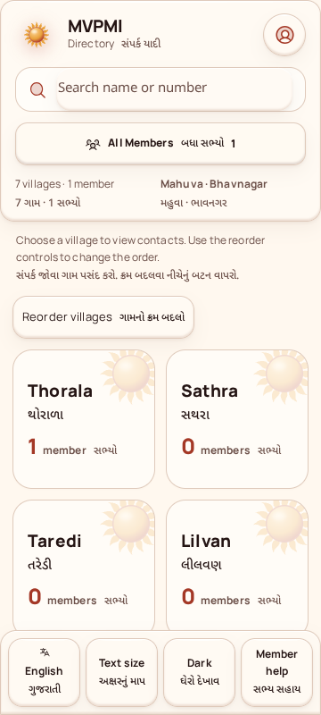
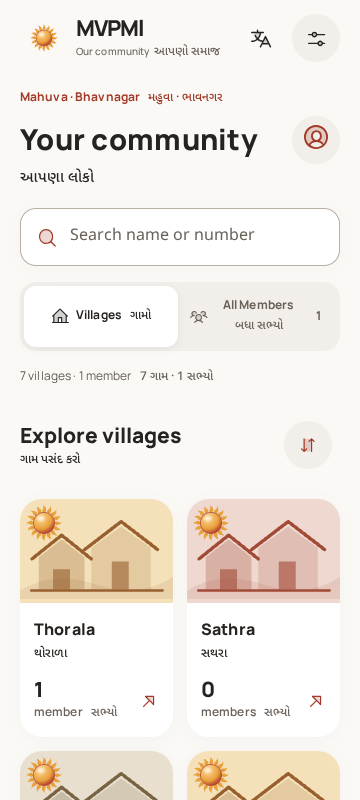

# Modern redesign — 17 September 2026

## Delivered direction

This is the whole-app redesign requested after the Liquid Glass review, not another rounding/shadow pass. The permanent bottom settings dock is **removed from the rendered markup**. A compact global Sun/wordmark header places language and preferences at the top right. Preferences opens a focused sheet with mutually exclusive language/theme segments, the continuous 85–165% slider, effects, and member help.

The design keeps the terracotta/marigold identity and original Sun. Modernity comes from typography, grouping, illustrations, segmented controls, and action placement—not extra destinations, food/music features, or a new brand palette.

### What changed across the app

| Area               | Before this checkpoint                                            | Current implementation                                                                                                                             |
| ------------------ | ----------------------------------------------------------------- | -------------------------------------------------------------------------------------------------------------------------------------------------- |
| Global controls    | Permanent four-control bottom dock                                | Compact global header; preferences available before enrollment and on every screen                                                                 |
| Directory          | Several individually outlined controls; plain Sun-watermark tiles | Editorial heading, prominent search, connected Villages / All Members segments, illustrated village collections, compact reorder control           |
| Village selection  | Place context beside the count                                    | Selected village becomes the bilingual page heading; village browsing remains the active segment                                                   |
| Member cards       | Small icon-only contact actions                                   | Stronger member identity, compact location, full-width phone row, labelled Call / WhatsApp actions                                                 |
| Signup and editing | Nested material panels                                            | Editorial introduction, quieter form surface, consistent inputs and primary actions                                                                |
| Profile            | Repeated identical name strings; mixed surface treatment          | Deduplicated identical names, stored two-script names retained, clearer details and grouped actions                                                |
| Admin              | Previous glass dashboard and sign-in arrangement                  | Shared header, restrained restricted-access card, eight tonal dashboard cards, consistent section headers and forms; four-column desktop dashboard |
| Dialogs            | Original contact sheet with incremental styling                   | New contact sheet and preferences structure, consistent close/actions, no stacked preferences/recovery dialogs                                     |

The Sun illustrations on village tiles are generic vector artwork, **not photographs of those villages**. Screenshot contacts are synthetic test fixtures, not production records. No new data is seeded into the running app.

### Actual checkpoint comparison

Both images were generated from real builds at 360 × 800, using the same synthetic approval fixture. The left source was exported from the preserved tag without switching branches.

| Pre-Modern-Redesign                                                                         | Modern directory                                                                              |
| ------------------------------------------------------------------------------------------- | --------------------------------------------------------------------------------------------- |
|  |  |

Additional captured screens:

- [Gujarati-first directory](modern-design/screens/directory-tiles-gu-light-100.png)
- [Preferences sheet](modern-design/screens/reading-settings-gu.png)
- [Dark member directory](modern-design/screens/directory-list-en-dark-100.png)
- [Admin dashboard](modern-design/screens/admin-home-en-light-100.png)

Visual review covered signup, preferences, directory tiles/list, profile, admin sign-in/dashboard, contact sheets, desktop dashboard, and large-text admin screens. The full optional capture includes 46 screenshots; these six small images are the committed review evidence.

## Preserved behavior and boundaries

- Existing eleven-screen flow, approval-gated directory, seven villages, eight dashboard destinations.
- Approval, updates, removals, admin editing, archive, backups/restore/export, search, bilingual sorting, reordering, and assisted recovery.
- Call / WhatsApp remain real user-activated links with keyboard handling and retry links. Tests intercept navigation and never contact a synthetic number.
- Gujarati default; both languages visible with primacy switching. No automatic translation of stored names.
- Local Manrope/Noto Sans Gujarati, immediate continuous 85–165% sizing, minimum 48px interactive targets, keyboard/focus handling and reduced-motion/effects behavior.
- No Android minimum-SDK change (21); no native shader or new app dependency.
- Production startup guards and server authorization unchanged. This remains a development review build, not approval for real community data or distribution.

## Verification

Final local `npm run check` **passed**:

| Check                   | Result                                                                                                                                                   |
| ----------------------- | -------------------------------------------------------------------------------------------------------------------------------------------------------- |
| Node tests              | **87 passed**, 0 failed                                                                                                                                  |
| UI workflows            | Passed; added assertions for absent dock, one header, theme segments, focus restoration, non-stacking help, directory modes and selected-village heading |
| Contact interactions    | Passed keyboard activation, retry, clipboard failure modes, restricted iframe and Android-UA routing                                                     |
| Text sizing             | Passed 320/360/412px × both languages × four sizes, plus keyboard, reload persistence and reset                                                          |
| Embedded app            | Passed normal, cookie-blocked and storage-blocked modes                                                                                                  |
| App accessibility       | 29 states; **0 axe violations**; see the explicit modal caveat below                                                                                     |
| Materials/accessibility | 20 states; **0 axe violations and 0 incomplete results**; both themes, 85/165%, blur/translucent/opaque and OS preferences                               |
| Bilingual/recovery      | Passed, including a deterministic old-device revocation test                                                                                             |
| Dependency audit        | 0 reported vulnerabilities                                                                                                                               |

A separate high-capability `CAPTURE_DESIGN=1 npm run test:accessibility` run also passed the 29 states and captured both-language/both-theme directory/profile/dashboard variants. This is browser evidence, not physical GPU performance evidence.

### Accessibility uncertainty is retained, not silently discarded

Axe 4.13 reports `elmPartiallyObscuring` for the two language paragraphs in each contact sheet: its virtual paint-stack comparison includes different inert rows **behind an opaque sheet**. These are **four raw incomplete text checks across two scans**, not four violations and not a claim that axe itself resolved them.

`scripts/modal-contrast-checks.mjs` independently checks only this specific uncertainty: an opaque, unfiltered reading ancestor, containment, real browser hit-testing, and WCAG luminance contrast. All four measured **6.15:1** (minimum asserted 4.5:1). Other incomplete reasons and all violations still fail. Raw axe results and the independent measurements remain in `test-results/accessibility.json`. No axe rules are disabled.

Screen-reader-only slider/effects descriptions remain associated through `aria-describedby`. Visual overflow tests explicitly exclude those intentionally clipped descriptions, and separately prohibit putting interactive controls inside them.

### Regressions discovered and fixed

- Reorder controls initially overlapped the next illustrated tile: removed forced tile height and corrected the flex layout; pointer and keyboard reordering pass.
- Contact retries initially left the new sheet open: restored close-on-retry behavior while preserving the native link event.
- The opaque fallback overrode the preferences primary-button background: fixed selector precedence and reran both themes/material modes.
- The template evaluator does not support ternary expressions in attributes: the reorder control now receives an explicit accessible-label value from the controller.
- Full-suite testing reproduced a timing-dependent pre-existing recovery failure: a revoked preview token could be removed from storage but retained in the in-memory transport promise, trapping the old device on reconnect. Both are now invalidated; private view state is cleared. **Only GET state reconnects once**, mutations are never replayed, and blocked-device 403 responses do not mint replacement transports. An offline-controlled browser test and four unit tests protect this behavior. The previous remote CI failure had unavailable logs; its exact cause cannot be retrospectively confirmed.

## Source and reproduction

- `scripts/modern-design.mjs`: guarded structural adapter over the existing functional renderer. Missing structural markers fail the build instead of silently slicing the template.
- `web/modern-design.css`: shared tokens, layout, components, themes and responsive treatment.
- `web/bilingual.mjs`, `web/ui-copy.mjs`, `web/controller.js`: paired copy, explicit selection state and the recovery fix.
- `scripts/modern-design-checks.mjs`, `tests/modern-design.test.mjs`, `tests/preview-reconnect.test.mjs`: added regression contracts.

```sh
npm ci
npm run check
CAPTURE_DESIGN=1 npm run test:accessibility
# Captures: test-results/modern-design/screens/
# Material results: test-results/modern-design/material-checks.json
```

The baseline comparison can be reproduced with `git archive Pre-Modern-Redesign` into a separate directory and the previous capture command. Do not switch the session branch or modify the checkpoint.

## Checkpoints and rollback

**Pre-Modern-Redesign** was created and pushed **before edits**, targeting `6812495befa7e4bb96040fa7fd05942cff091b39`. Its exact source archive is `/home/user/checkpoints/MVPMI-Pre-Modern-Redesign.zip` in this review workspace.

cp001, cp002, Pre-LiquidGlass-Upgrade, Best1 and the original HTML/dossier remain untouched. To undo **only this modern redesign**, restore the tracked tree from Pre-Modern-Redesign and rebuild. The earlier documented `UNDO` convention for the Liquid Glass upgrade still targets Pre-LiquidGlass-Upgrade; these are distinct rollback points. Neither operation rolls back live database contents, secrets, or browser preferences.

## Remaining limits

- No physical Android/TalkBack, native font-scale, OEM keyboard, real calling/WhatsApp intent, or GPU/performance validation was performed.
- Native-speaker Gujarati review and the user's visual acceptance remain necessary. Intentional editorial hierarchy means fewer village tiles fit above the fold than the old compact view; the bottom dock no longer consumes reading space.
- The compact reorder icon relies on its accessible label/tooltip; it should be included in user testing.
- This workspace has no Java/Android SDK; any new native compilation is reported separately through CI, not inferred from browser success.
- Existing release, ownership verification, operational backup and privacy blockers remain in [RELEASE_AUDIT.md](RELEASE_AUDIT.md).

Swiggy search/category hierarchy and an unofficial Spotify UI-kit reference informed grouping and controls. WhatsApp, Zomato and Apple Music were direction references supplied by the user, not audited app dependencies or sources of copied assets.
